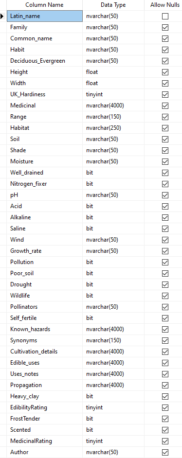

# food-forest-planner
To view web app run

``` 
export FLASK_APP=app
export FLASK_ENV=development
flask run
```

# Adding the Edible Plants Database
The edible plants database for this application is from [Plants for a Future](https://pfaf.org/user/default.aspx), and is available for purchase as flat files. This application expects to find the database in a local SQL Server. Follow instructions from Microsoft [here](https://www.microsoft.com/en-us/sql-server/sql-server-downloads) for SQL Server installation. For ease of use, I also reccomend you install [Microsoft SQL Server Management Studio](https://learn.microsoft.com/en-us/ssms/download-sql-server-management-studio-ssms).
Once both are installed, open SSMS and create a new database named "Food Forest". Import the data from Plants for a Future by right clicking on the new database > Task > Import Flat File. This will open up an import window; follow the instructions to import the file. Due to the length of text in some of the columns, the number of characters allowed by default had to be extended; these are the settings I used for a succesful import. For now, also set Latin_name to be the Primary Key.



SQL Server Version: SQL Server 2022 Developer  
Edible Plants Database: Plants for a Future, purchased 4/2025